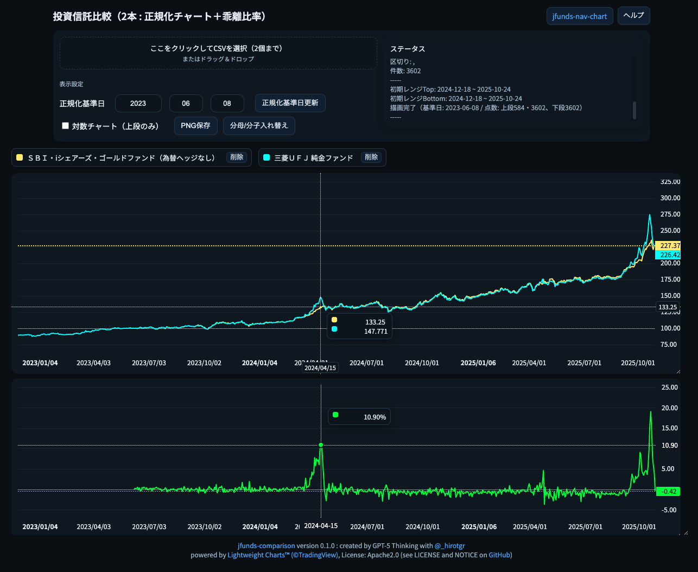
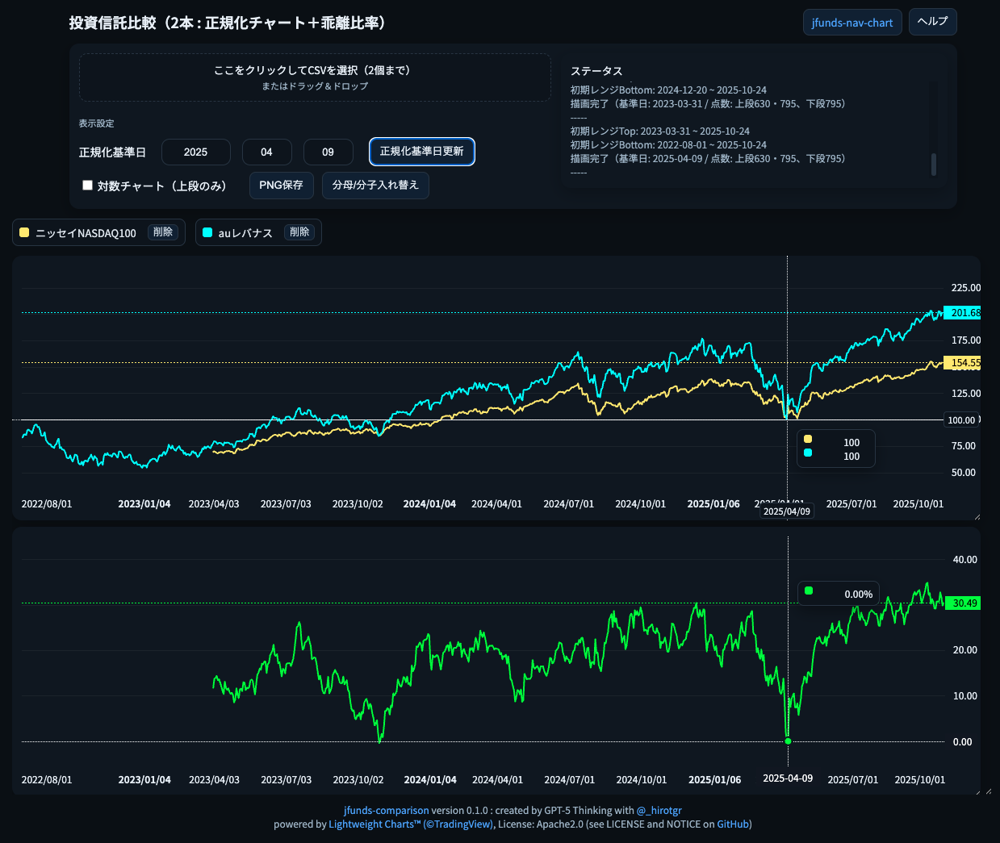

# GitHub Pages

* [https://hirotgr.github.io/jfunds-comparison/jfunds-comparison.html](https://hirotgr.github.io/jfunds-comparison/jfunds-comparison.html)
  * サンプルCSVファイル: [ダウンロード](https://raw.githubusercontent.com/hirotgr/jfunds-nav-chart/main/sample-csv.zip)

# ダウンロード

このツールはHTMLファイル単体で機能するので「名前を付けて保存」などでローカルにダウンロードして使用可能することができます。

# 関連ツール

* [jfunds-nav-chart](https://hirotgr.github.io/jfunds-nav-chart/jfunds-nav-chart.html) ([リポジトリ](https://github.com/hirotgr/jfunds-nav-chart))

# これは何？

* **jfunds-nav-chart.html** から派生した投資信託のパフォーマンス比較ツールです。
* GitHub PagesのURLにアクセスするか、ダブルクリック等で **jfunds-comparison.html** をブラウザで開き、投資信託運用会社のサイトからダウンロードしたCSVファイルをドラッグ＆ドロップすればチャートを表示できます。
* CSVファイルのファイル名は投信コードなどからファンド名に変更してください。CSVファイルの1行目に投資信託名が記載してある場合はファイル名の変更は不要です (例: 三菱UFJアセットマネジメント、大和アセットマネジメント)
  * CSVフォーマットが複雑な場合は対応していません。詳しくは**jfunds-nav-chart.html**のヘルプを参照してください。
* **2つの投資信託**について、任意の日付の価額を100として正規化し、パフォーマンスを比較できます。◯◯ショックなどでの下落率比較には正規化基準日前のチャートが必要ですが、証券会社やYAHOOでは対応していません。
* 同じインデックスに投資する投資信託、"ニッセイNASDAQ100とauレバナス"のようによく比較対象になる投信など、2つの投資信託を比較するために、任意の日付で基準価額を正規化し、パフォーマンスを比較できます。
* 正規化した基準価額を元に **[(ファンド1/ファンド2) - 1]** を計算し、パフォーマンス比較チャートを描画します。分母/分子を入れ替えることができます。
* チャートの右下をつかんで動かせばチャートサイズを変更できます。チャート操作はTradingViewに準拠しています。
* 使い方はページ右上の **ヘルプ** ボタンを押して確認してください。
* 機能拡張などは基本的にするつもりはありません(気が向いたらやるかも)。

# 使用の前提

* Lightweight Charts™︎ (©TradingView) ライブラリ取得のために CDN `https://cdn.jsdelivr.net/` への接続性が必要です
* Googleのフォントライブラリ `https://fonts.googleapis.com` への接続性が必要です。
* 上記以外、外部への通信は行っていません。**心配な場合はウィルスチェックをしたり、ChatGPTやGeminiにフィアルを放り込んでコードの内容や安全性を質問してください。**

# 投資信託CSVデータの例

jfunds-nav-chartの[リポジトリ](https://github.com/hirotgr/jfunds-nav-chart)のREADME.mdを参照してください。

# ライセンスなど

* これはGPT-5 Thinkingがコーディングしたものです。hirotgr はほとんどコードを書いておらず、著作権を主張しません。自由に改変可能です。
* このアプリの使用によって何らかの損害が発生しても、hirotgr は責任を負いません。
* TradingViewがApache 2.0ライセンスで提供しているLightweight Charts™︎ (©TradingView) を使用しています。利用条件などはGitHubなどを参照してください。
  * https://jp.tradingview.com/lightweight-charts/
  * https://github.com/tradingview/lightweight-charts
* GoogleとAdobeが共同開発し、Googleから提供されている Noto Sans JP フォントを使用しています。ライセンスはSIL Open Font License 1.1です。詳しくは以下を参照してください。
  * https://developers.google.com/fonts/faq?hl=ja
  * https://fonts.google.com/

# 使用イメージ

同じゴールドを投資対象とする2つのファンドを比較し、乖離がないかを確認する
* 三菱UFJ純金ファンド (東証 1540 ETFに投資)
* SBIサクッと純金 (ロンドン IGLN ETFに投資)

 

同じNASDAQ100が投資対象だが、レバレッジの有無が異なるニッセイNASDAQ100とauAMレバレッジNASDAQ100について、2025/04/09(トランプ関税ショック底値)を正規化基準日とした比較 (価額回復だけではなく、ドローダウンの状況も参照可能)

